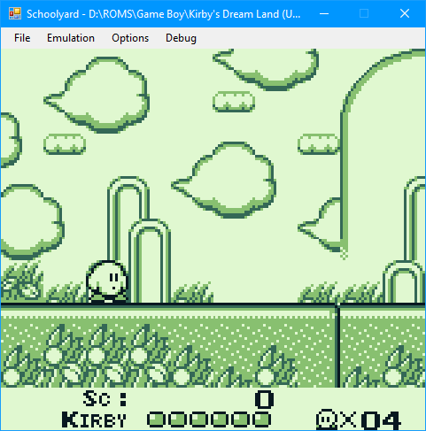

# Schoolyard

Schoolyard is an original Gameboy Emulator.
It is being designed in a simple and readable manner.

It is named Schoolyard because that is where Gameboy's used to be played a lot.
Schoolyard is currently under development. It can only run test carts, but fails at some tests.

## Games

* Tetris: Playable
* Dr.Mario: Playable
* Kirby's Dream Land: Playable
* Super Mario Land: Stage doesn't scroll
* Link's Awakening: Playable

## Known Issues

* Super mario land: Stages don't scroll
* Dr Mario: The bugs at the bottom animate very fast
* In 16x8 sprite mode, the bottom pixels will appear at the top.
* No audio (unimplemented)

## Todo's
* Pass all tests
* Comb-through the Opcode table and package any repetitive code
* Implement more memory controllers
* CGB support!

### Tests

* OPUS5: Display
* Blarggs
  * cpu_instrs: Halts
  * 01-special: Passes
  * 02-interrupts: Fails
  * 03-op sp,hl: Passes
  * 04-op r,imm: Passes
  * 05-op rp: Passes
  * 06-ld r,r: Passes
  * 07-jr,jp,call,ret,rst: Passes
  * 08-misc instrs: Passes
  * 09-op r,r: Passes
  * 10-bit ops: Passes
  * 11-op a,(hl): Passes

